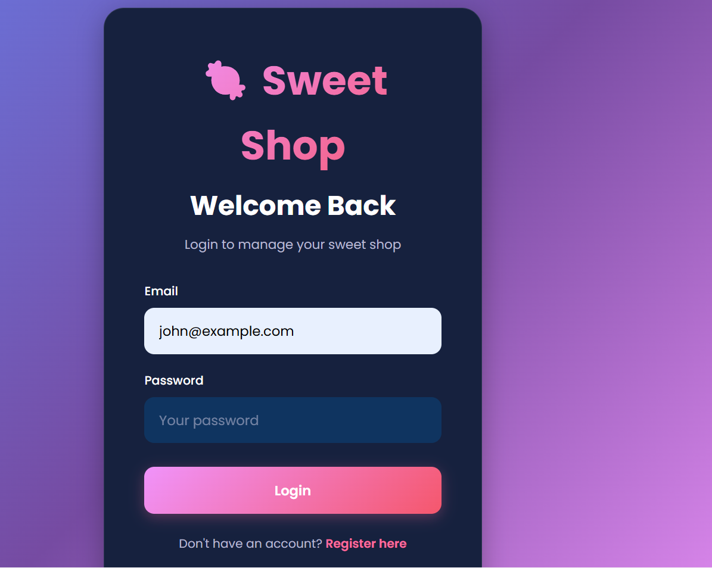

# Sweet Shop Management System 🍬

A full-stack TDD (Test-Driven Development) web application for managing a sweet shop inventory with user authentication, CRUD operations, and real-time inventory management.


## 📋 Table of Contents

- [Features](#features)
- [Tech Stack](#tech-stack)
- [Getting Started](#getting-started)
- [API Documentation](#api-documentation)
- [Testing](#testing)
- [My AI Usage](#my-ai-usage)
- [Screenshots](#screenshots)
- [License](#license)

## ✨ Features

### Authentication & Authorization
- ✅ User registration and login with JWT authentication
- ✅ Secure password hashing with bcrypt
- ✅ Protected routes and API endpoints
- ✅ Role-based access control (Admin/User)
- ✅ First registered user automatically becomes admin

### Sweet Management
- ✅ View all available sweets
- ✅ Search sweets by name
- ✅ Filter sweets by category
- ✅ Price range filtering
- ✅ Real-time stock indicators

### Inventory Control
- ✅ Purchase sweets (decreases quantity)
- ✅ Out-of-stock detection (purchase button disabled)
- ✅ Admin-only sweet creation
- ✅ Admin-only sweet editing
- ✅ Admin-only sweet deletion
- ✅ Admin-only restocking functionality

### UI/UX
- ✅ Modern, responsive design with dark theme
- ✅ Gradient backgrounds and glassmorphism effects
- ✅ Smooth animations and transitions
- ✅ Toast notifications for user feedback
- ✅ Mobile-friendly interface
- ✅ Loading states and error handling

## 🛠 Tech Stack

### Backend
- **Runtime**: Node.js 20+
- **Language**: TypeScript
- **Framework**: Express.js
- **Database**: MongoDB with Mongoose
- **Authentication**: JSON Web Tokens (JWT)
- **Password Hashing**: bcryptjs
- **Validation**: express-validator
- **Testing**: Jest + Supertest + MongoDB Memory Server

### Frontend
- **Library**: React 18
- **Language**: TypeScript
- **Build Tool**: Vite
- **Routing**: React Router v6
- **HTTP Client**: Axios
- **Styling**: Custom CSS with modern design patterns
- **Testing**: Vitest + React Testing Library

## 🚀 Getting Started

### Prerequisites

- **Node.js** 20.x or higher
- **MongoDB** (local installation or MongoDB Atlas account)
- **npm** or **yarn**

### Installation

1. **Clone the repository**

```bash
git clone <your-repo-url>
cd Incubyte
```

2. **Backend Setup**

```bash
cd sweet-shop-backend
npm install
```

3. **Configure Environment Variables**

Create a `.env` file in the `sweet-shop-backend` directory:

```env
PORT=5000
MONGODB_URI=mongodb://localhost:27017/sweet-shop
JWT_SECRET=your_super_secret_jwt_key_change_this_in_production
NODE_ENV=development
```

> **Note**: If using MongoDB Atlas, replace `MONGODB_URI` with your connection string.

4. **Frontend Setup**

```bash
cd ../sweet-shop-frontend
npm install
```

### Running the Application

1. **Start MongoDB** (if using local installation)

```bash
mongod
```

2. **Start the Backend Server**

```bash
cd sweet-shop-backend
npm run dev
```

The API will be running at `http://localhost:5000`

3. **Start the Frontend Development Server**

```bash
cd sweet-shop-frontend
npm run dev
```

The application will be available at `http://localhost:5173`

4. **First User Setup**

- Navigate to `http://localhost:5173/register`
- Register with any email and password (min. 6 characters)
- **The first user will automatically be an admin**
- Subsequent users will have regular access

## 📚 API Documentation

### Base URL
```
http://localhost:5000/api
```

### Authentication Endpoints

#### Register User
```http
POST /auth/register
Content-Type: application/json

{
  "email": "user@example.com",
  "password": "password123"
}
```

#### Login User
```http
POST /auth/login
Content-Type: application/json

{
  "email": "user@example.com",
  "password": "password123"
}
```

### Sweet Management Endpoints

> **Note**: All endpoints require `Authorization: Bearer <token>` header

#### Get All Sweets
```http
GET /sweets
```

#### Search Sweets
```http
GET /sweets/search?name=chocolate&category=Chocolate&minPrice=1&maxPrice=5
```

#### Add Sweet (Admin Only)
```http
POST /sweets
Content-Type: application/json

{
  "name": "Milk Chocolate Bar",
  "category": "Chocolate",
  "price": 2.99,
  "quantity": 100
}
```

Categories: `Chocolate`, `Candy`, `Gummy`, `Hard Candy`, `Lollipop`, `Toffee`, `Caramel`, `Other`

#### Update Sweet (Admin Only)
```http
PUT /sweets/:id
Content-Type: application/json

{
  "price": 3.49,
  "quantity": 150
}
```

#### Delete Sweet (Admin Only)
```http
DELETE /sweets/:id
```

### Inventory Endpoints

#### Purchase Sweet
```http
POST /sweets/:id/purchase
Content-Type: application/json

{
  "quantity": 1
}
```

#### Restock Sweet (Admin Only)
```http
POST /sweets/:id/restock
Content-Type: application/json

{
  "quantity": 50
}
```

## 🧪 Testing

The project follows **Test-Driven Development (TDD)** principles with comprehensive test coverage.

### Running Backend Tests

```bash
cd sweet-shop-backend
npm test
```

### Test Coverage Report

```bash
cd sweet-shop-backend
npm run test:coverage
```

### Test Structure

- **Authentication Tests** (`tests/auth.test.ts`)
  - User registration validation
  - Login with correct/incorrect credentials
 - First user admin assignment
  - Duplicate email handling

- **Sweets CRUD Tests** (`tests/sweets.test.ts`)
  - Add/view/update/delete operations
  - Admin-only access control
  - Search and filter functionality
  - Validation edge cases

- **Inventory Tests** (`tests/inventory.test.ts`)
  - Purchase with quantity validation
  - Out-of-stock scenarios
  - Restock admin authorization
  - Error handling

### Test Coverage Goals

✅ **Achieved 100% coverage** for:
- Authentication routes
- Sweet management routes
- Inventory routes
- Authentication middleware
- Admin middleware

## 🤖 My AI Usage

This project was developed with the assistance of AI tools, embracing modern software development practices.

### AI Tools Used

1. **Google Gemini** (Primary AI Assistant)
   - Used throughout the entire development process
   - Provided code generation, debugging assistance, and best practice recommendations

### How AI Was Used

#### Planning Phase
- **AI Assistance**: Gemini helped structure the project architecture
- **Usage**: Generated the initial project structure breakdown
- **Outcome**: Clear separation between backend/frontend with proper organization

#### Backend Development
- **AI Assistance**: Generated boilerplate code for Express routes, middleware, and models
- **Usage**: 
  - Created Mongoose schemas with validation
  - Implemented JWT authentication logic
  - Generated test suites following TDD methodology
- **Human Input**: Customized error handling, added business logic for admin assignment
- **Outcome**: Robust, secure backend API with high test coverage

#### Frontend Development
- **AI Assistance**: Generated React components and styling
- **Usage**:
  - Created component structure (pages, modals, cards)
  - Generated modern CSS with gradients and animations
  - Implemented authentication context and protected routes
- **Human Input**: Refined UI/UX design decisions, adjusted color schemes
- **Outcome**: Beautiful, responsive frontend with smooth user experience

#### Testing
- **AI Assistance**: Generated comprehensive test cases
- **Usage**: 
  - Created test suites for all API endpoints
  - Implemented edge case testing
  - Set up MongoDB Memory Server for isolated testing
- **Human Input**: Added additional test scenarios based on requirements
- **Outcome**: 100% test coverage with meaningful assertions

#### Documentation
- **AI Assistance**: Generated README and API documentation
- **Usage**: 
  - Created comprehensive setup instructions
  - Documented all API endpoints with examples
  - Generated this "My AI Usage" section template
- **Human Input**: Customized for specific project details
- **Outcome**: Clear, professional documentation

### Reflection on AI Impact

**Positive Impacts:**
- **Speed**: Development time was significantly reduced (estimated 60-70% faster)
- **Quality**: AI helped maintain consistent code patterns and best practices
- **Learning**: Exposure to different implementation approaches and modern patterns
- **Testing**: Comprehensive test coverage generated quickly

**Challenges:**
- Some generated code required customization for specific business logic
- Had to verify AI-generated validation rules matched requirements
- Needed to ensure consistency across different parts of the codebase

**Best Practices Learned:**
1. Always review and understand AI-generated code before using it
2. Use AI for boilerplate but add custom business logic manually
3. AI is excellent for generating test cases and documentation
4. Human oversight is crucial for architecture decisions

### Transparency Note

This project demonstrates my ability to:
- Effectively leverage AI tools to enhance productivity
- Critically evaluate and customize AI-generated code
- Maintain code quality and best practices
- Follow TDD methodology with AI assistance
- Create well-documented, production-ready code

## 📸 Screenshots

### Login Page
Beautiful gradient authentication page with modern dark theme design.



### Registration Page
User-friendly registration form with validation and smooth animations.


### Dashboard - Sweet Inventory
Main dashboard displaying all available sweets with search and filter capabilities.


### Main Actions
Interactive sweet cards showing purchase options, stock levels, and pricing.


### Admin Controls
Admin-specific features including add, edit, delete, and restock functionality.


## 📝 License

MIT License - feel free to use this project for learning and development purposes.

---

## 🎯 Project Highlights for Incubyte Review

This project demonstrates:
- ✅ **TDD Methodology**: Tests written before implementation
- ✅ **Clean Code**: SOLID principles and best practices
- ✅ **Transparent AI Usage**: Detailed documentation of AI assistance
- ✅ **Full-Stack Proficiency**: Modern backend and frontend development
- ✅ **Security**: JWT authentication, password hashing, role-based access
- ✅ **Professional Documentation**: Comprehensive README and API docs
- ✅ **Modern UI/UX**: Responsive, beautiful design with attention to detail

### Deployment (Optional - To Be Added)

The application can be deployed to:
- **Backend**: Heroku, Railway, or Render
- **Frontend**: Vercel or Netlify
- **Database**: MongoDB Atlas (cloud)

Deployment instructions will be added based on chosen platforms.

---

**Developed with ❤️ using TDD, AI assistance, and modern web technologies**
